# WPF 透明窗口可以调整尺寸（通过拖拽窗口边缘）

```
本文遵循 CC 4.0 BY-SA 版权协议
作者：絮大王
```

**通过这篇文章，我们可以实现：**

1. 让WPF的透明窗口可以通过拖拽窗口的边缘，自由的调整尺寸。

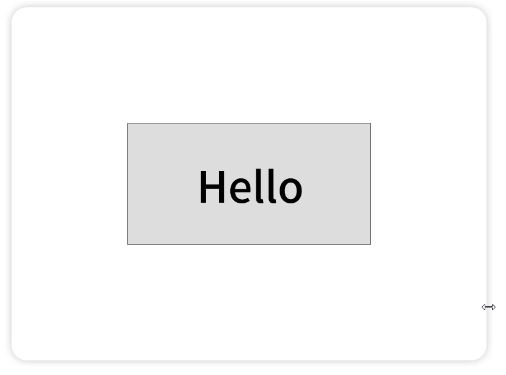


2. 我们可以通过拖拽窗口的上方，来移动窗口。

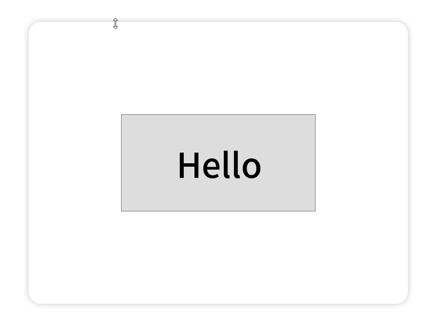


3. 我们可以禁止窗口拖到屏幕边缘时自动最大化。

4. 还可以等比例的改变窗口的大小。


5. 还可以等比例的改变窗口中控件的大小


## 参考文章

> **AllowsTransparency="True" 怎么放大缩小窗体**
>
> 作者：[不灬赖](https://blog.csdn.net/LJianDong)
>
> 原文地址：https://blog.csdn.net/LJianDong/article/details/99844199


> **C# WPF 如何禁止窗口拖到屏幕边缘自动最大化**
>
> 作者：[Bird鸟人](https://blog.csdn.net/wcc27857285)
>
> 原文地址：https://blog.csdn.net/wcc27857285/article/details/78223901


> **WPF窗口比例如何保持恒定？**
>
> 作者：[a7066163](https://my.csdn.net/a7066163)、[Hauk](https://my.csdn.net/haukwong)
>
> 原文地址：https://bbs.csdn.net/topics/390257164


## 目录

- 创建1个“透明窗口”
- 通过拖拽调整“透明窗口”的尺寸
- 通过拖拽移动“透明窗口”
- 禁止窗口自动最大化
- 等比例的改变窗口的大小
- 等比例的改变窗口中控件的大小
- 完整代码


## 创建1个“透明窗口”

“透明窗口”指的是Window.AllowsTransparency属性为true的窗口。

但是想要`Window.AllowsTransparency=“True”`，我们需要让`Window.WindowStyle="None"`。

如果`Window.WindowStyle="None"`，我们就不能够再通过拖拽窗口的边缘，改变窗口的尺寸了；也不能通过拖拽窗口的上方，来移动窗口的位置了。

那怎么办呢？

我们一步一步来，首先我们需要创建1个透明窗口，作为演示。


**第1步：**我们创建1个新的WPF工程。

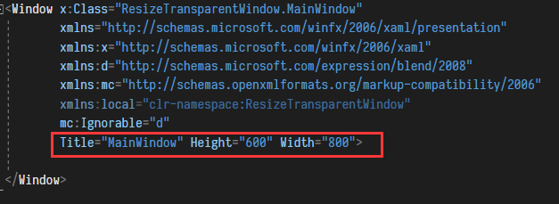

​			

​			现在窗口是这样的 ↓

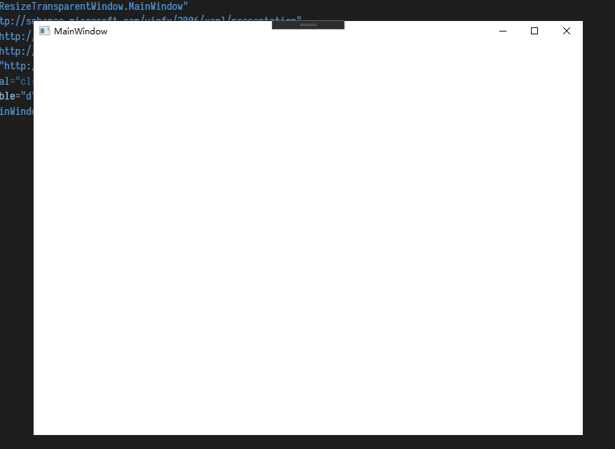


**第2步：**设置窗口的背景为透明色。

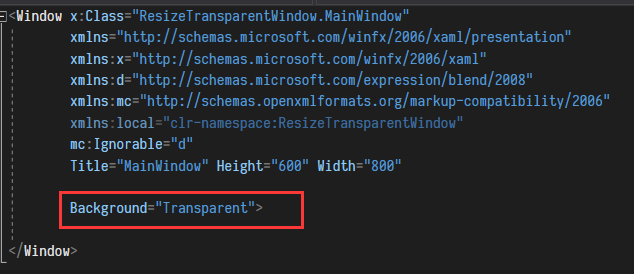

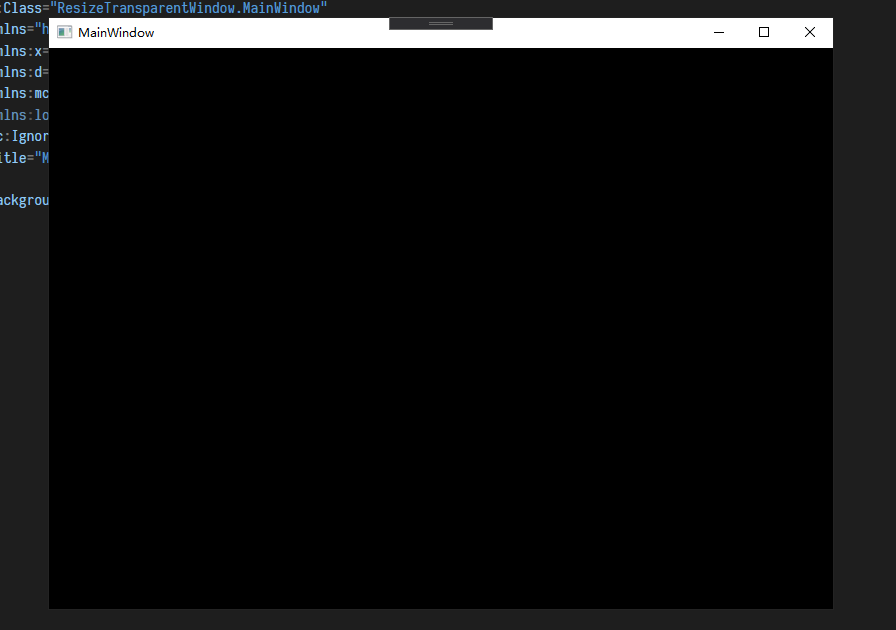


**第3步：**但是，我们可以看到，现在窗口的背景是黑色的，并没有变透明，为什么呢？

​			  因为，我们没有允许窗口可以是透明的。

​			  我们在Window控件中，设置`AllowsTransparency="True"`，就可以允许窗口变透明啦！

​			  但是这样运行时会报错，因为如果`AllowsTransparency="True"`，那么WindowStyle属性必须为None！

​			  我们在Window控件中，设置WindowStyle="None"，这样一来，我们就得到了一个完全透明的窗口啦！

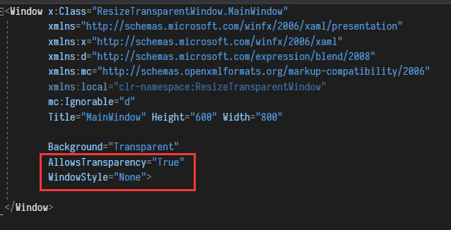


​			  因为窗口是完全透明的，所以我们完全看不到窗口啦！


**第4步：**我们往窗口里加入一点东西（不然我们什么都看不见啦）。

​			  这里我们在窗口中加入一个白色的背景，并给背景一个圆角，并且让背景有个好看的阴影。

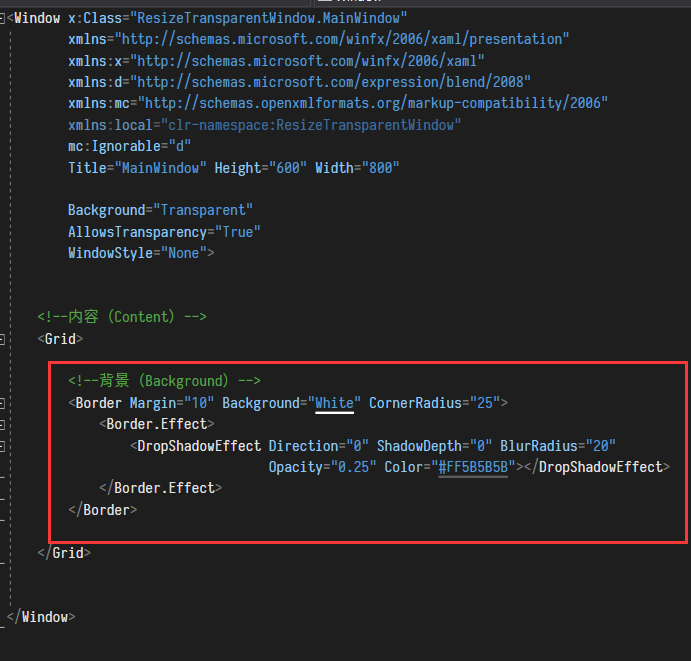

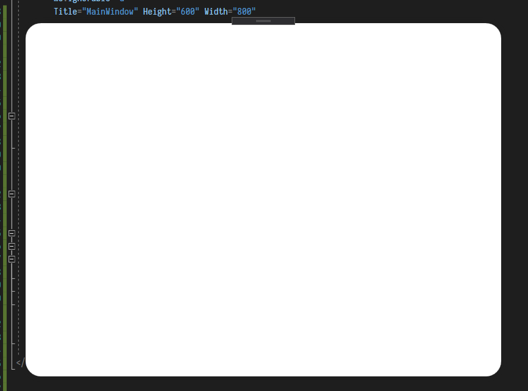


​			为了方便观察，我们把窗口放到一个白色区域中。


**第5步：**我们在窗口中，再放入一个按钮。

​			 透明窗口就创建好啦！


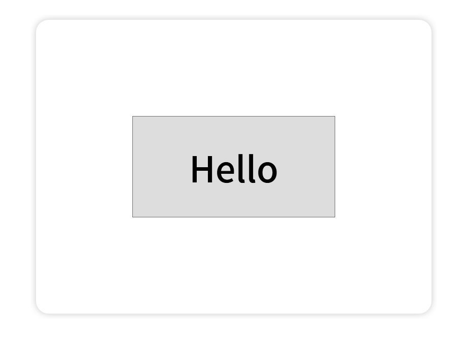


**代码 (MainWindow.xaml)：**

```xaml
<Window x:Class="ResizeTransparentWindow.MainWindow"
        xmlns="http://schemas.microsoft.com/winfx/2006/xaml/presentation"
        xmlns:x="http://schemas.microsoft.com/winfx/2006/xaml"
        xmlns:d="http://schemas.microsoft.com/expression/blend/2008"
        xmlns:mc="http://schemas.openxmlformats.org/markup-compatibility/2006"
        xmlns:local="clr-namespace:ResizeTransparentWindow"
        mc:Ignorable="d"
        Title="MainWindow" Height="600" Width="800"
        

        Background="Transparent"
        AllowsTransparency="True"
        WindowStyle="None">


    <!--内容（Content）-->
    <Grid>
    
        <!--背景（Background）-->
        <Border Margin="10" Background="White" CornerRadius="25">
            <Border.Effect>
                <DropShadowEffect Direction="0" ShadowDepth="0" BlurRadius="20" 
                                  Opacity="0.25" Color="#FF5B5B5B"></DropShadowEffect>
            </Border.Effect>
        </Border>
    
        <!--按钮（Button）-->
        <Button Width="400" Height="200">
            <TextBlock Width="400" Height="100" TextAlignment="Center"
                       FontSize="70" FontFamily="Source Han Sans CN Medium"
                       Text="Hello"/>
        </Button>
    
    </Grid>

</Window>
```


## 通过拖拽调整“透明窗口”的尺寸

现在，我们没有办法通过拖拽窗口的边缘，调整透明窗口的尺寸。

怎么办呢？

别担心，我们可以使用WindowChrome类。这样我们既能让窗口透明，又能实现缩放窗口！

```
如果你想了解更多关于WindowChrome类的信息，可以查看微软的官方文档：
https://docs.microsoft.com/zh-cn/dotnet/api/system.windows.shell.windowchrome?view=netframework-4.8
```


**第1步：**在Window控件中，创建1个WindowChrome。

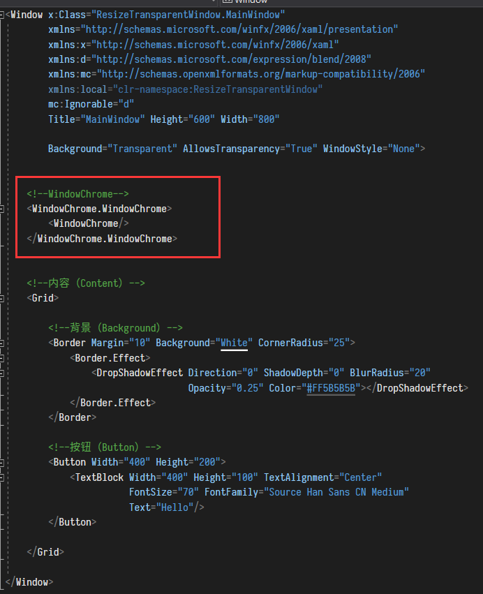


**第2步：**此时，我们可以看到，我们把鼠标移动到窗口边缘拖动后，就已经可以改变窗口的大小啦！

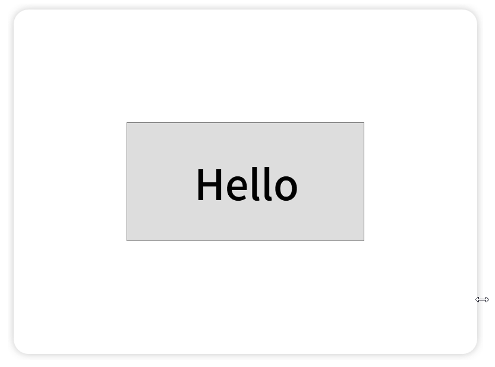


**第3步：**为了更加完美，我们还可以设置下WindowChrome的`CaptionHeight属性`和`ResizeBorderThickness属性`。

		CaptionHeight属性：设置标题栏的高度。
	    ResizeBorderThickness属性：设置拖拽调整窗口区域的宽度（如果你的窗口有阴影的话，可以把这个值调整的更大一点）
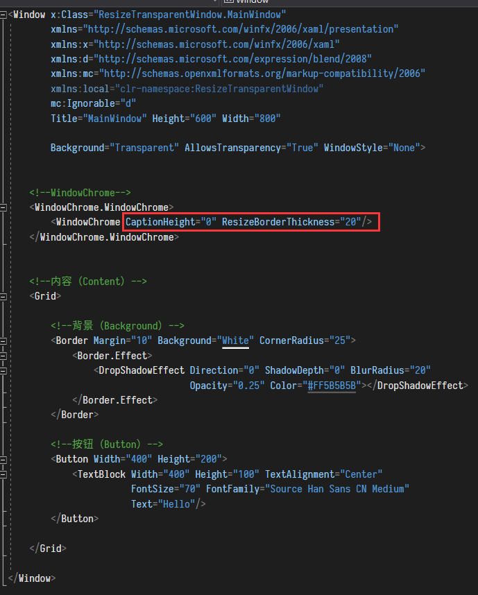


**代码 (MainWindow.xaml)：**

```xaml
<Window x:Class="ResizeTransparentWindow.MainWindow"
        xmlns="http://schemas.microsoft.com/winfx/2006/xaml/presentation"
        xmlns:x="http://schemas.microsoft.com/winfx/2006/xaml"
        xmlns:d="http://schemas.microsoft.com/expression/blend/2008"
        xmlns:mc="http://schemas.openxmlformats.org/markup-compatibility/2006"
        xmlns:local="clr-namespace:ResizeTransparentWindow"
        mc:Ignorable="d"
        Title="MainWindow" Height="600" Width="800"
        

        Background="Transparent"
        AllowsTransparency="True"
        WindowStyle="None">


    <!--WindowChrome-->
    <WindowChrome.WindowChrome>
        <WindowChrome CaptionHeight="0" ResizeBorderThickness="20"/>
    </WindowChrome.WindowChrome>


    <!--内容（Content）-->
    <Grid>
    
        <!--背景（Background）-->
        <Border Margin="10" Background="White" CornerRadius="25">
            <Border.Effect>
                <DropShadowEffect Direction="0" ShadowDepth="0" BlurRadius="20" 
                                  Opacity="0.25" Color="#FF5B5B5B"></DropShadowEffect>
            </Border.Effect>
        </Border>
    
        <!--按钮（Button）-->
        <Button Width="400" Height="200">
            <TextBlock Width="400" Height="100" TextAlignment="Center"
                       FontSize="70" FontFamily="Source Han Sans CN Medium"
                       Text="Hello"/>
        </Button>
    
    </Grid>

</Window>
```


## 通过拖拽移动“透明窗口”

因为我们设置了Window控件的`WindowStyle="None"`，因此我们现在没有办法通过拖拽来移动窗口。

怎么办呢？

这个特别简单！

我们只需要在按下鼠标的时候，调用Window的`DragMove()`方法，就可以啦！


**第1步：**我们创建1个Border，命名为TopBorder。

​			  我们希望当我们按住这个Border的时候，就可以拖动窗口。

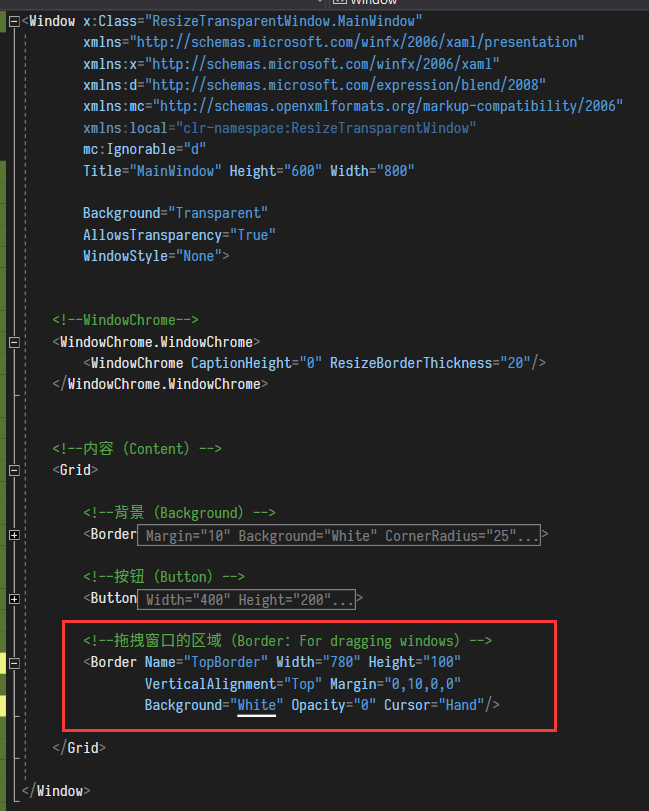

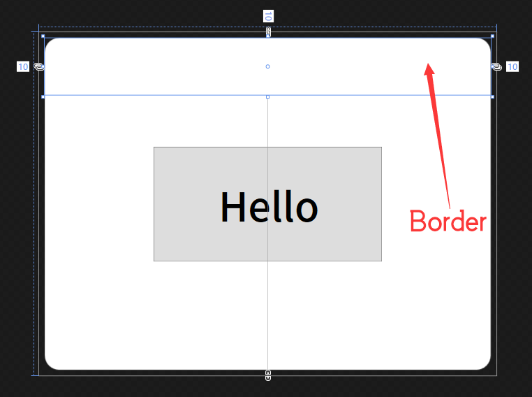


**第2步：**注册TopBorder的MouseLeftButtonDown事件。

​			  （当我们在TopBorder控件身上按下鼠标左键时，就会触发这个MouseLeftButtonDown事件）

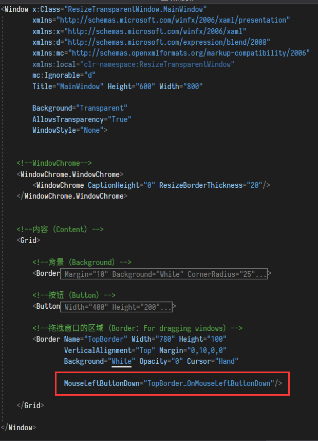


**第3步：**我们在MainWindow.cs中，这样写。

```
Window类的DragMove()方法，用于当鼠标左键按下后，移动鼠标可以拖动窗口。
```


**第4步：**现在我们就可以随意的拖动窗口啦！


**代码 (MainWindow.xaml)：**

```Xaml
<Window x:Class="ResizeTransparentWindow.MainWindow"
        xmlns="http://schemas.microsoft.com/winfx/2006/xaml/presentation"
        xmlns:x="http://schemas.microsoft.com/winfx/2006/xaml"
        xmlns:d="http://schemas.microsoft.com/expression/blend/2008"
        xmlns:mc="http://schemas.openxmlformats.org/markup-compatibility/2006"
        xmlns:local="clr-namespace:ResizeTransparentWindow"
        mc:Ignorable="d"
        Title="MainWindow" Height="600" Width="800"
        

        Background="Transparent"
        AllowsTransparency="True"
        WindowStyle="None">


    <!--WindowChrome-->
    <WindowChrome.WindowChrome>
        <WindowChrome CaptionHeight="0" ResizeBorderThickness="20"/>
    </WindowChrome.WindowChrome>


    <!--内容（Content）-->
    <Grid>
    
        <!--背景（Background）-->
        <Border Margin="10" Background="White" CornerRadius="25">
            <Border.Effect>
                <DropShadowEffect Direction="0" ShadowDepth="0" BlurRadius="20" 
                                  Opacity="0.25" Color="#FF5B5B5B"></DropShadowEffect>
            </Border.Effect>
        </Border>
    
        <!--按钮（Button）-->
        <Button Width="400" Height="200">
            <TextBlock Width="400" Height="100" TextAlignment="Center"
                       FontSize="70" FontFamily="Source Han Sans CN Medium"
                       Text="Hello"/>
        </Button>
    
        <!--拖拽窗口的区域（Border：For dragging windows）-->
        <Border Name="TopBorder" Width="780" Height="100"
                VerticalAlignment="Top" Margin="0,10,0,0"
                Background="White" Opacity="0" Cursor="Hand"
                
                MouseLeftButtonDown="TopBorder_OnMouseLeftButtonDown"/>
    
    </Grid>

</Window>
```


**代码 (MainWindow.cs)：**

```c#
using System.Windows;
using System.Windows.Input;


namespace ResizeTransparentWindow
{
    /// <summary>
    /// MainWindow.xaml 的交互逻辑
    /// </summary>
    public partial class MainWindow : Window
    {
        public MainWindow()
        {
            InitializeComponent();
        }


        /// <summary>
        /// 当用鼠标左键点击TopBorder控件时，触发此方法
        /// (This method is triggered when the TopBorder control is clicked with the left mouse button)
        /// </summary>
        private void TopBorder_OnMouseLeftButtonDown(object sender, MouseButtonEventArgs e)
        {
            /* 当点击拖拽区域的时候，让窗口跟着移动
             (When clicking the drag area, make the window follow) */
            DragMove();
        }
    
    }

}
```


## 禁止窗口自动最大化

现在我们的窗口拖拽到屏幕上方时，会自动最大化。

我们可以不最大化窗口吗？

当然可以！

[Bird鸟人](https://blog.csdn.net/wcc27857285)大佬用了一种非常巧妙的方法实现了这个功能。

```
原文地址：https://blog.csdn.net/wcc27857285/article/details/78223901
```


> **思路：**
>
> 因为拖到屏幕边缘自动最大化，有个必要条件是鼠标按下去，然后拖。
>
> 我们可以利用这个间隙将ResizeMode设置为NoResize，然后鼠标放开之后再把ResizeMode设置回CanResize，就可以啦！


**代码 (MainWindow.cs)：**

```c#
using System.Windows;
using System.Windows.Input;

namespace ResizeTransparentWindow
{
    /// <summary>
    /// MainWindow.xaml 的交互逻辑
    /// </summary>
    public partial class MainWindow : Window
    {
        public MainWindow()
        {
            InitializeComponent();
        }


        /// <summary>
        /// 当用鼠标左键点击TopBorder控件时，触发此方法
        /// (This method is triggered when the TopBorder control is clicked with the left mouse button)
        /// </summary>
        private void TopBorder_OnMouseLeftButtonDown(object sender, MouseButtonEventArgs e)
        {
    
            /* 如何在Window.ResizeMode属性为CanResize的时候，阻止窗口拖动到屏幕边缘自动最大化。
               (When the Window.ResizeMode property is CanResize, 
               when the window is dragged to the edge of the screen, 
               it prevents the window from automatically maximizing.)*/
            if (e.ChangedButton == MouseButton.Left)
            {
                if (Mouse.LeftButton == MouseButtonState.Pressed)
                {
                    var windowMode = this.ResizeMode;
                    if (this.ResizeMode != ResizeMode.NoResize)
                    {
                        this.ResizeMode = ResizeMode.NoResize;
                    }
    
                    this.UpdateLayout();


                    /* 当点击拖拽区域的时候，让窗口跟着移动
                    (When clicking the drag area, make the window follow) */
                    DragMove();


                    if (this.ResizeMode != windowMode)
                    {
                        this.ResizeMode = windowMode;
                    }
    
                    this.UpdateLayout();
                }
            }
        }
    
    }

}
```


## 等比例的改变窗口的大小

那我们可以在拖动鼠标调整窗口大小时，等比例的放大/缩小窗口吗？

比如，可以一直让窗口的比例为4比3吗？

当然可以哒！

这里参考了[a7066163](https://my.csdn.net/a7066163)、[Hauk](https://my.csdn.net/haukwong)的方法。

使用这种方法，不仅可以按照比例缩放窗口，还可以避免闪烁的问题！

```
原文地址：https://bbs.csdn.net/topics/390257164
```


> **思路：**
>
> ```
> 【首先Hauk给出了自己的思路】：
> 拖拉时显示窗口内容  不勾选时：一次拖动只触发一次SizeChanged事件
> 拖拉时显示窗口内容  勾选时：一次拖动只触发 N 次SizeChanged事件(n=newsize-oldsize)
> 
> 触发太频繁所以界面更新有点不对劲。
> 可以使用timer来延迟更新,等用户拖好了来。            
> ```
>
> ```
> 【然后a7066163在Hauk想法的基础上做了更改】：
> 虽然在在鼠标释放的慢的情况下，窗口会退回原来的大小，所以我只在处理鼠标释放的事件就行了。
> 不过貌似自带边框的鼠标事件不属于窗口事件，最后我直接捕获WM_EXITSIZEMOVE消息，重载了窗口消息处理函数。
> 通过定时器和WM_EXITSIZEMOVE消息处理的双重保证下，大致能实现窗口比例实时恒定的效果。
> ```


**效果：**


**代码 (MainWindow.cs)：**

```c#
using System;
using System.Windows;
using System.Windows.Input;
using System.Windows.Interop;

namespace ResizeTransparentWindow
{
    /// <summary>
    /// MainWindow.xaml 的交互逻辑
    /// </summary>
    public partial class MainWindow : Window
    {
        public MainWindow()
        {
            InitializeComponent();
        }


        //最后的宽度（Last Width）
        private int LastWidth;
    
        //最后的高度（Last Height）
        private int LastHeight;
    
        //这个属性是指 窗口的宽度和高度的比例（宽度/高度）(4:3)
        //This property refers to the aspect ratio (width / height) of the window (4: 3)
        private float AspectRatio = 4.0f / 3.0f;


        /// <summary>
        /// 捕获窗口拖拉消息
        /// (Capturing window drag messages)
        /// </summary>
        protected override void OnSourceInitialized(EventArgs e)
        {
            base.OnSourceInitialized(e);
            HwndSource source = HwndSource.FromVisual(this) as HwndSource;
            if (source != null)
            {
                source.AddHook(new HwndSourceHook(WinProc));
            }
        }
    
        public const Int32 WM_EXITSIZEMOVE = 0x0232;
    
        /// <summary>
        /// 重载窗口消息处理函数
        /// (Overload window message processing function)
        /// </summary>
        private IntPtr WinProc(IntPtr hwnd, Int32 msg, IntPtr wParam, IntPtr lParam, ref Boolean handled)
        {
            IntPtr result = IntPtr.Zero;
            switch (msg)
            {
                //处理窗口消息 (Handle window messages)
                case WM_EXITSIZEMOVE:
                {
                    //上下拖拉窗口 (Drag window vertically)
                    if (this.Height != LastHeight)
                    {
                        this.Width = this.Height * AspectRatio;
                    }
                    // 左右拖拉窗口 (Drag window horizontally)
                    else if (this.Width != LastWidth)
                    {
                        this.Height = this.Width / AspectRatio;
                    }
    
                    LastWidth = (int)this.Width;
                    LastHeight = (int)this.Height;
                    break;
                }
            }
    
            return result;
        }
    }

}
```


## 等比例的改变窗口中控件的大小

那我们可以在更改窗口大小时，等比例的更改窗口中控件的大小吗？

当然可以啦！

这里我们用Viewbox控件，就可以实现这个功能啦！


**第1步：**我们只需要把所有的控件都放进Viewbox控件中。

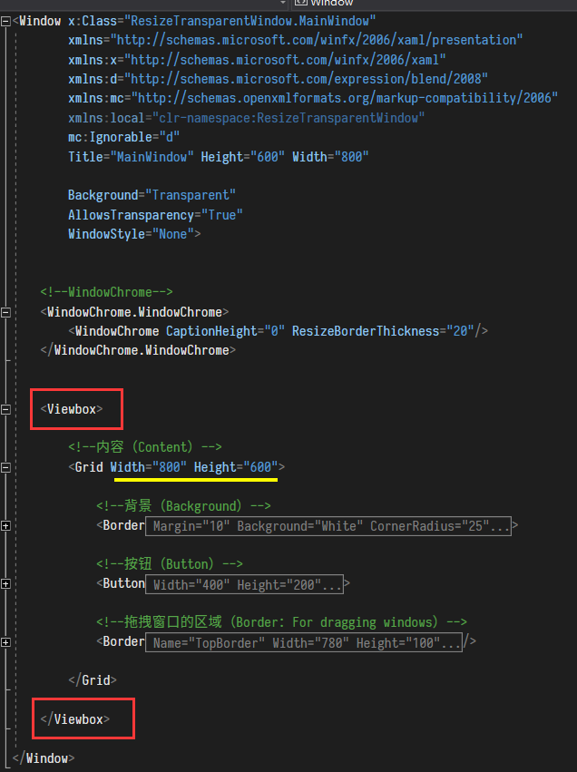


**第2步：**然后，设置Viewbox的Stretch属性为UniformToFill

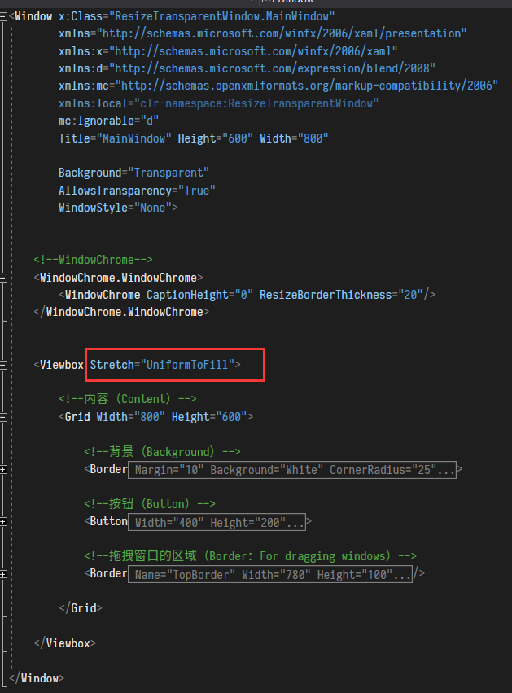


**第3步：**现在，我们缩放窗口时，窗口中的内容也会自动等比例进行缩放啦！


**代码 (MainWindow.xaml)：**

```xaml
<Window x:Class="ResizeTransparentWindow.MainWindow"
        xmlns="http://schemas.microsoft.com/winfx/2006/xaml/presentation"
        xmlns:x="http://schemas.microsoft.com/winfx/2006/xaml"
        xmlns:d="http://schemas.microsoft.com/expression/blend/2008"
        xmlns:mc="http://schemas.openxmlformats.org/markup-compatibility/2006"
        xmlns:local="clr-namespace:ResizeTransparentWindow"
        mc:Ignorable="d"
        Title="MainWindow" Height="600" Width="800"
        

        Background="Transparent"
        AllowsTransparency="True"
        WindowStyle="None">


    <!--WindowChrome-->
    <WindowChrome.WindowChrome>
        <WindowChrome CaptionHeight="0" ResizeBorderThickness="20"/>
    </WindowChrome.WindowChrome>


    <!--Viewbox-->
    <Viewbox Stretch="UniformToFill">
    
        <!--内容（Content）-->
        <Grid Width="800" Height="600">
    
            <!--背景（Background）-->
            <Border Margin="10" Background="White" CornerRadius="25">
                <Border.Effect>
                    <DropShadowEffect Direction="0" ShadowDepth="0" BlurRadius="20" 
                                      Opacity="0.25" Color="#FF5B5B5B">		
                    </DropShadowEffect>
                </Border.Effect>
            </Border>
    
            <!--按钮（Button）-->
            <Button Width="400" Height="200">
                <TextBlock Width="400" Height="100" TextAlignment="Center"
                           FontSize="70" FontFamily="Source Han Sans CN Medium"
                           Text="Hello"/>
            </Button>
    
        </Grid>
    
    </Viewbox>

</Window>
```


## 完整代码

**MainWindow.xaml：**

```Xaml
<Window x:Class="ResizeTransparentWindow.MainWindow"
        xmlns="http://schemas.microsoft.com/winfx/2006/xaml/presentation"
        xmlns:x="http://schemas.microsoft.com/winfx/2006/xaml"
        xmlns:d="http://schemas.microsoft.com/expression/blend/2008"
        xmlns:mc="http://schemas.openxmlformats.org/markup-compatibility/2006"
        xmlns:local="clr-namespace:ResizeTransparentWindow"
        mc:Ignorable="d"
        Title="MainWindow" Height="600" Width="800"
        

        Background="Transparent"
        AllowsTransparency="True"
        WindowStyle="None">


    <!--WindowChrome-->
    <WindowChrome.WindowChrome>
        <WindowChrome CaptionHeight="0" ResizeBorderThickness="20"/>
    </WindowChrome.WindowChrome>


    <!--Viewbox-->
    <Viewbox Stretch="UniformToFill">
    
        <!--内容（Content）-->
        <Grid Width="800" Height="600">
    
            <!--背景（Background）-->
            <Border Margin="10" Background="White" CornerRadius="25">
                <Border.Effect>
                    <DropShadowEffect Direction="0" ShadowDepth="0" BlurRadius="20" 
                                      Opacity="0.25" Color="#FF5B5B5B"></DropShadowEffect>
                </Border.Effect>
            </Border>
    
            <!--按钮（Button）-->
            <Button Width="400" Height="200">
                <TextBlock Width="400" Height="100" TextAlignment="Center"
                           FontSize="70" FontFamily="Source Han Sans CN Medium"
                           Text="Hello"/>
            </Button>
    
            <!--拖拽窗口的区域（Border：For dragging windows）-->
            <Border Name="TopBorder" Width="780" Height="100"
                    VerticalAlignment="Top" Margin="0,10,0,0"
                    Background="White" Opacity="0" Cursor="Hand"
                
                    MouseLeftButtonDown="TopBorder_OnMouseLeftButtonDown"/>
    
        </Grid>
    
    </Viewbox>

</Window>
```


**MainWindow.cs：**

```c#
using System;
using System.Windows;
using System.Windows.Input;
using System.Windows.Interop;

namespace ResizeTransparentWindow
{
    /// <summary>
    /// MainWindow.xaml 的交互逻辑
    /// </summary>
    public partial class MainWindow : Window
    {
        public MainWindow()
        {
            InitializeComponent();
        }


        #region [拖动窗口 (Drag Move Window)]
    
        /// <summary>
        /// 当用鼠标左键点击TopBorder控件时，触发此方法
        /// (This method is triggered when the TopBorder control is clicked with the left mouse button)
        /// </summary>
        private void TopBorder_OnMouseLeftButtonDown(object sender, MouseButtonEventArgs e)
        {
            /* 当点击拖拽区域的时候，让窗口跟着移动
               (When clicking the drag area, make the window follow) */
            DragMove();
        }
    
        #endregion


        #region [等比例调整窗口尺寸（Proportional Resize window）]
    
        //最后的宽度（Last Width）
        private int LastWidth;
    
        //最后的高度（Last Height）
        private int LastHeight;
    
        //这个属性是指 窗口的宽度和高度的比例（宽度/高度）(4:3)
        //This property refers to the aspect ratio (width / height) of the window (4: 3)
        private float AspectRatio = 4.0f / 3.0f;


        /// <summary>
        /// 捕获窗口拖拉消息
        /// (Capturing window drag messages)
        /// </summary>
        protected override void OnSourceInitialized(EventArgs e)
        {
            base.OnSourceInitialized(e);
            HwndSource source = HwndSource.FromVisual(this) as HwndSource;
            if (source != null)
            {
                source.AddHook(new HwndSourceHook(WinProc));
            }
        }
    
        public const Int32 WM_EXITSIZEMOVE = 0x0232;
    
        /// <summary>
        /// 重载窗口消息处理函数
        /// (Overload window message processing function)
        /// </summary>
        private IntPtr WinProc(IntPtr hwnd, Int32 msg, IntPtr wParam, IntPtr lParam, ref Boolean handled)
        {
            IntPtr result = IntPtr.Zero;
            switch (msg)
            {
                //处理窗口消息 (Handle window messages)
                case WM_EXITSIZEMOVE:
                {
                    //上下拖拉窗口 (Drag window vertically)
                    if (this.Height != LastHeight)
                    {
                        this.Width = this.Height * AspectRatio;
                    }
                    // 左右拖拉窗口 (Drag window horizontally)
                    else if (this.Width != LastWidth)
                    {
                        this.Height = this.Width / AspectRatio;
                    }
    
                    LastWidth = (int) this.Width;
                    LastHeight = (int) this.Height;
                    break;
                }
            }
    
            return result;
        }


        #endregion


    }

}
```

